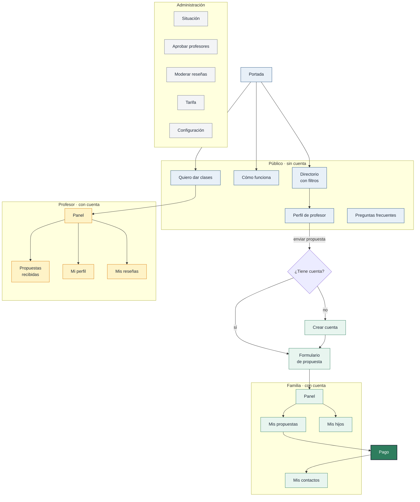

# Mapa de pantallas

Inventario de pantallas y recorridos. Ver [sistema de diseño](sistema-diseno.md)
para la especificación visual.

---

## 1. Mapa general



---

## 2. Portada

El objetivo único es llevar al directorio. Todo lo demás es secundario.

**Sección principal.** Titular «Encuentra profesor para tu hijo. Sabiendo de dónde
viene.» Debajo, el buscador con los dos filtros que más importan —asignatura y
colegio— y el botón de ver profesores. Junto a él, enlace secundario para
profesores que quieran darse de alta.

Se entra directamente en materia: el buscador va arriba, no después de tres
secciones de explicación.

**Prueba social.** Valoración media, número de profesores verificados y logos de
los colegios representados. La fila de logos comunica el diferencial sin
explicarlo.

**Cómo funciona, en tres pasos.** Busca y filtra · Envía una propuesta gratis ·
Paga solo si acepta. El tercer paso lleva énfasis: es lo que elimina la objeción.

**Por qué es distinto.** Tres bloques: procedencia verificada, se paga solo si hay
acuerdo, y los pagos de clases se acuerdan directamente.

**Reseñas destacadas**, tres o cuatro seleccionadas por administración.

**Cierre** sobre fondo verde con la llamada a ver profesores.

---

## 3. Directorio

La pantalla más importante del producto.

**Escritorio:** columna de filtros fija a la izquierda, resultados en rejilla de
tres columnas a la derecha, con el contador y el selector de orden encima.

**Móvil:** resultados en columna única, botón flotante de filtros con el número de
activos, y panel deslizante desde abajo.

El filtro de colegio va siempre el primero, con logos y recuento por opción.

Los filtros aplicados aparecen como píldoras eliminables sobre los resultados.

**Sin resultados:** ilustración, explicación y —lo importante— qué filtro relajar,
con el número de resultados que daría.

---

## 4. Perfil de profesor

**Cabecera:** foto grande, nombre e inicial, badge del colegio, titulación,
valoración, matches completados. A la derecha en escritorio, una tarjeta fija con
la tarifa orientativa, el botón de enviar propuesta y, debajo, el mensaje que más
importa: *«Es gratis. Solo pagas si acepta.»*

En móvil esa tarjeta se convierte en barra fija inferior.

**Cuerpo:** sobre mí, qué imparte por etapas, expediente y certificaciones,
disponibilidad orientativa, y reseñas.

---

## 5. Envío de propuesta

Un diálogo, no una página nueva: se evita perder el contexto del perfil.

Tres pasos cortos. Elegir alumno, indicar asignaturas y modalidad, escribir un
mensaje opcional. Antes de enviar, un resumen con el recordatorio de gratuidad.

Tras enviar, confirmación explicando qué pasa ahora: el profesor tiene 48 horas
para responder y se le avisará por correo y WhatsApp.

---

## 6. Panel de la familia

**Inicio:** lo que requiere acción arriba. Si hay una propuesta aceptada pendiente
de pago, ocupa la posición principal con el botón de desbloquear.

**Mis propuestas:** listado con estado, cuenta atrás cuando aplica, y acción
correspondiente. Rechazo y caducidad muestran siempre dos o tres alternativas.

**Mis contactos:** los teléfonos desbloqueados, con acceso directo a WhatsApp.
Permanente.

**Mis hijos** y **mis datos**, incluida la eliminación de cuenta.

No hay sección de bono, ni de clases, ni de pagos a profesores.

---

## 7. Panel del profesor

**Inicio:** propuestas pendientes con su cuenta atrás, en primer lugar. Debajo,
resumen de actividad.

**Propuestas:** cada una con los datos del alumno y el mensaje de la familia, y los
botones de aceptar o rechazar. Rechazar abre un diálogo que pide motivo.

Antes del pago, ningún dato de contacto de la familia es visible. Después, aparece
con acceso directo a WhatsApp.

**Mi perfil** con vista previa, **mis reseñas** con opción de responder una vez, y
**estadísticas**.

---

## 8. Panel de administración

Optimizado para revisión rápida, a menudo desde el móvil.

**Situación:** avisos primero, y si no hay ninguno, decirlo. Debajo, cifras clave y
embudo de conversión.

**Aprobar profesores:** la pantalla más usada. Ficha completa y dos acciones
separadas —aprobar y verificar colegio—, porque son dos juicios distintos.

**Moderar reseñas**, **tarifa** con motivo obligatorio, **configuración** con
descripciones a la vista, y **catálogos**.

---

## 9. Recorrido crítico

El que no puede fallar, con el número de pasos objetivo:

```
Portada → Directorio → Perfil → Propuesta → [espera] → Pago → Contacto
   1          2           3          4                    5        6
```

De la portada al perfil de un profesor: **dos clics**. Del perfil al envío de la
propuesta: **un diálogo de tres pasos**. Del aviso de aceptación al teléfono: **un
clic y el pago**.

---

## 10. Pendiente

- [ ] Bocetos de baja fidelidad de las cinco pantallas principales
- [ ] Diseño de alta fidelidad del directorio y el perfil
- [ ] Prototipo navegable del recorrido crítico
- [ ] Prueba con tres o cuatro familias reales antes de desarrollar
