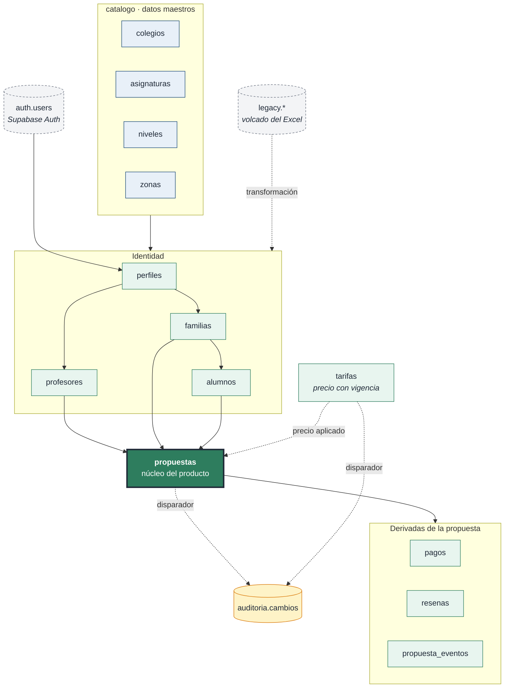
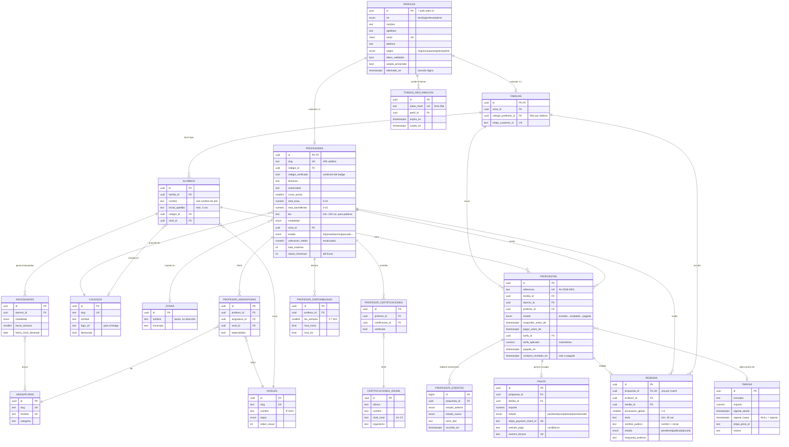
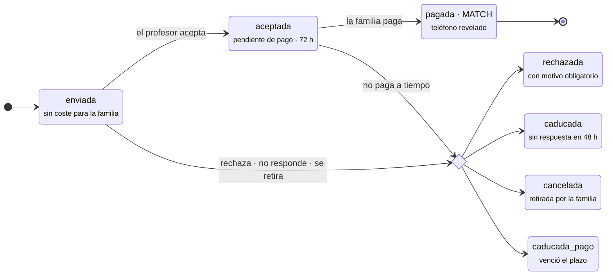
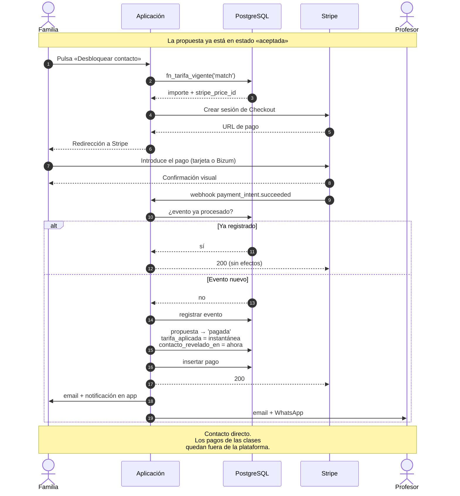
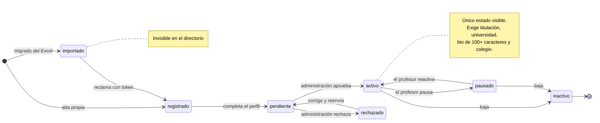
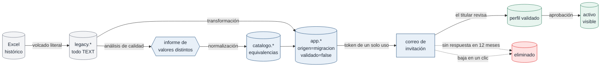
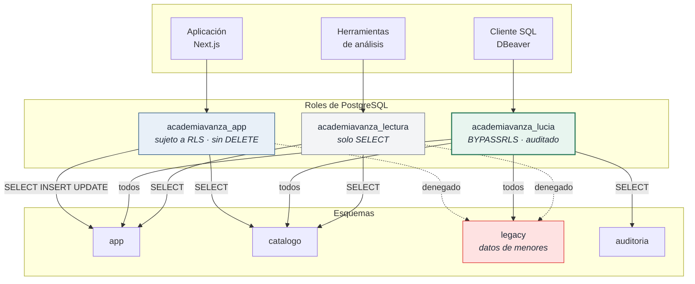

# Diagramas del modelo de datos

Diagramas en [Mermaid](https://mermaid.js.org/), que GitHub renderiza de forma
nativa. Complementan la especificación en [modelo-datos.md](modelo-datos.md).

---

## 1. Mapa general por dominios

Vista de conjunto, sin campos, para entender cómo se relacionan los cuatro
esquemas.

---

## 2. Diagrama entidad-relación completo

---

## 3. Ciclo de vida de una propuesta

El estado `pagada` es el match. Es el único que permite revelar el teléfono.

---

## 4. Flujo de cobro y revelado

Detalle de la parte que mueve dinero, incluido el control de idempotencia.

---

## 5. Ciclo de vida del perfil de profesor

---

## 6. Migración: de Excel a la plataforma

La separación en dos etapas hace la carga **repetible**: si aparece un error de
mapeo, se corrige la transformación y se vuelve a ejecutar sin tocar el Excel.

---

## 7. Roles y acceso

Separar la identidad de Lucía de la de la aplicación permite que la auditoría
distinga automáticamente un cambio hecho por el producto de una edición manual.

---

## 8. Cómo editar estos diagramas

Son texto plano en Mermaid dentro de bloques de código. GitHub los renderiza sin
configuración adicional.

Para editarlos con vista previa: [mermaid.live](https://mermaid.live).

En VS Code, la extensión *Markdown Preview Mermaid Support* los muestra en la
vista previa integrada.
