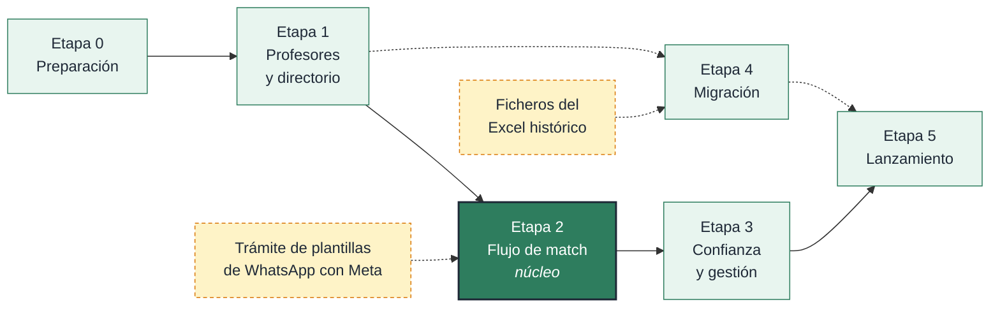

# Plan de desarrollo

---

## 1. Enfoque

Se construye por **capacidades completas de extremo a extremo**, no por capas. Cada
etapa deja algo que funciona y se puede probar con personas reales.

El orden lo marca una regla: **primero lo que bloquea a lo demás.** Sin profesores
en el directorio no hay nada que buscar; sin búsqueda no hay propuestas; sin
propuestas no hay cobro.

---

## 2. Etapas

### Etapa 0 — Preparación

Repositorio, proyecto Next.js con TypeScript y Tailwind, Supabase creado y esquema
aplicado, Prisma conectado, despliegue en Vercel funcionando, cuentas de Stripe,
Resend y WATI dadas de alta, y dominio apuntando.

**Se termina cuando:** hay una página en `academiavanza.es` desplegada
automáticamente desde `main` y el esquema está aplicado en la nube.

> **Empezar ya el trámite de plantillas de WhatsApp.** Meta tarda días en
> aprobarlas y bloquean el lanzamiento si se dejan para el final.

---

### Etapa 1 — Profesores en el directorio

Lo primero porque sin oferta no hay producto.

Registro de profesor con todos los campos, subida de foto, autenticación,
aprobación desde un panel mínimo, perfil público, y directorio con filtros
—empezando por el de colegio, que es el diferencial—.

**Se termina cuando:** un profesor se registra, Lucía lo aprueba, y aparece en el
directorio con su badge, filtrable por colegio y asignatura.

**Cómo se comprueba:** dar de alta tres o cuatro profesores reales conocidos y
pedirles que completen el registro sin ayuda.

---

### Etapa 2 — El flujo de match

El núcleo. La etapa más delicada y la que más pruebas necesita.

Registro de familia y alta de alumnos, envío de propuesta, notificación al profesor
por correo y WhatsApp, aceptación o rechazo, cobro con Stripe, revelado del
teléfono, y las tareas programadas de caducidad.

**Se termina cuando:** una familia envía una propuesta, el profesor la acepta, la
familia paga con Stripe en modo prueba y ve el teléfono. Y cuando una propuesta sin
responder caduca sola.

**Cómo se comprueba:** además de las pruebas automáticas, recorrer el flujo entero
a mano con dos personas reales, incluyendo los casos de rechazo y caducidad.

> Es la etapa donde un fallo cuesta dinero. Las pruebas de extremo a extremo del
> cobro no son opcionales.

---

### Etapa 3 — Confianza y gestión

Lo que hace el producto sostenible una vez funciona.

Sistema de reseñas con moderación, panel de administración completo, tarifa
configurable desde la interfaz, portada definitiva con el sistema de diseño,
preguntas frecuentes, y textos legales.

**Se termina cuando:** Lucía puede cambiar el precio desde el panel, aprobar
profesores, moderar reseñas y ver el estado del negocio sin tocar la base de datos.

---

### Etapa 4 — Migración

Deliberadamente al final: no tiene sentido cargar datos históricos hasta que la
plataforma funciona.

Guiones de carga, informe de calidad, normalización de catálogos, transformación,
tokens de reclamación, pantalla de validación de perfil y envío escalonado de
invitaciones.

**Se termina cuando:** un profesor migrado recibe el correo, revisa sus datos, los
corrige y publica su perfil.

> **Bloqueada** hasta disponer de los ficheros del Excel histórico.

---

### Etapa 5 — Lanzamiento

Stripe en modo real, plantillas de WhatsApp aprobadas, analítica, posicionamiento,
revisión de accesibilidad y rendimiento, copias de seguridad verificadas, y prueba
de carga.

**Se termina cuando:** una familia real completa un match pagando de verdad.

---

## 3. Orden de dependencias

Las dos cajas amarillas son dependencias externas que no dependen del desarrollo y
conviene arrancar cuanto antes.

---

## 4. Pruebas

**Unitarias** sobre la lógica de negocio: transiciones de estado, cálculo de
plazos, resolución de tarifa vigente, validaciones. Sin base de datos.

**De integración** sobre los repositorios y los endpoints, contra una base de datos
real efímera. Aquí se comprueba que las restricciones de PostgreSQL hacen su
trabajo: que no se puede revelar un contacto sin pago ni reseñar sin match.

**De extremo a extremo** con Playwright sobre los recorridos que no pueden fallar:
el flujo completo de match con pago, el registro y aprobación de un profesor, la
búsqueda con filtros, y la reclamación de un perfil migrado.

**Del esquema** en cada cambio: se aplican todos los ficheros SQL desde cero sobre
una base limpia. Ya está montado en la integración continua.

### Qué se prueba siempre

| Comprobación | Dónde |
|---|---|
| No revelar contacto sin pago | Integración |
| No reseñar sin match pagado | Integración |
| Webhook repetido no duplica nada | Integración |
| Cambiar la tarifa no altera cobros pasados | Integración |
| No dos propuestas vivas con el mismo profesor y alumno | Integración |
| El flujo de pago completo | Extremo a extremo |
| El esquema aplica desde cero | Integración continua |

---

## 5. Integración continua

Ya configurada en `.github/workflows/ci.yml`:

1. Estilo y comprobación de tipos
2. Pruebas unitarias
3. **Validación del esquema SQL** contra PostgreSQL real
4. Compilación

Sobre `main`, además: aplicar migraciones, desplegar y comprobación de humo.

---

## 6. Riesgos

| Riesgo | Impacto | Qué hacer |
|---|---|---|
| Las plantillas de WhatsApp tardan en aprobarse | Alto | Iniciar el trámite en la etapa 0 |
| El Excel histórico no llega | Medio | La etapa 4 es independiente; no bloquea el lanzamiento |
| Pocos profesores en el directorio al abrir | Alto | Captación manual en paralelo desde la etapa 1 |
| Fallo en el cobro | Alto | Pruebas de extremo a extremo obligatorias; alerta de webhooks |
| El precio resulta estar mal puesto | Medio | Es configurable; se ajusta viendo `app.gestion_embudo` |
| Lucía no disponible durante el desarrollo | Medio | Documentar decisiones en ADR según se toman |

---

## 7. Cuándo se puede lanzar

- [ ] Al menos 10 profesores activos con badge verificado
- [ ] Flujo de match probado de extremo a extremo con personas reales
- [ ] Stripe en modo real, con un cobro real comprobado
- [ ] Plantillas de WhatsApp aprobadas por Meta
- [ ] Tareas programadas ejecutándose y verificadas
- [ ] Panel de administración operativo
- [ ] Textos legales publicados
- [ ] Lighthouse por encima de 90
- [ ] Copia de seguridad probada, incluida la restauración
- [ ] Lucía sabe cambiar el precio y aprobar profesores sin ayuda
